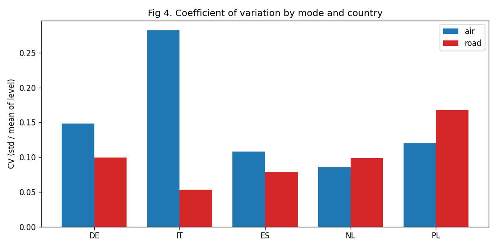

# EU Freight Rate Risk Monitor
Air vs road freight rate risk, quantified for procurement decisions.

Air rates run about 1.6x road's volatility inside a 6.7% annual band with a hard Q2 peak.
Built on open Eurostat and INSEE data, six EU markets, every chart backed by a statistical
test. The result is a set of contracting rules: fix, tender or ride spot.

## Who this is for
- Freight category managers: when to tender and how wide to budget - dedicated edition: [freight-tender-timing](https://github.com/khareparag/freight-tender-timing).
- Pricing and tender teams: volatility, the Q2 peak, the trough-lock edge - dedicated edition: [freight-pricing-volatility](https://github.com/khareparag/freight-pricing-volatility).
- Forward Deployment Engineers: the same study set in motion - [freight-rate-stream](https://github.com/khareparag/freight-rate-stream).

This repo stays the canonical home of the analysis. The editions present it per audience and sync from here.

## The decision
Air and road freight carry different rate risk, so they should be contracted and budgeted
differently. Index-link or shorten air agreements and tender them into the Q4-Q1 trough.
Hold road on longer fixed terms. Budget air as a band, not a point.

## The evidence (three numbers)
1. Air rate volatility is about 1.63x road's (CV 0.155 vs 0.095) on six EU markets,
   2003 to 2024. The variance gap is statistically significant (Levene p below 1e-14) and
   survives removing the pandemic years: ratio 1.35 excluding 2020-2022, 1.41 pre-COVID.
2. In a typical year air moves inside a 6.7% band, road 2.8%. On 10 million euro of air
   spend the band is about 670,000 euro of rate movement a buyer plans for or explains later.
3. Air peaks in Q2, climbing about 3.2% into the spring quarter. Backtested across 85
   market-years: locking air at trough-season levels beat peak-season locks in 75% of
   years, average edge 1.8%, Germany 8 of 9 years. Out of sample, the Q2 climb repeated
   in 10 of 12 market-years in 2024-2025.

The rule is not uniform, and this is the point. In Poland road is the volatile mode
(CV 0.167 vs air 0.120). In France the timing rule fails (44% hit rate on a freight-only
series). Segment by market, validate per lane, then contract.



## The monitor
A five-tab Power BI Rate Risk Monitor: Overview with a plain-language verdict, Volatility,
Seasonality, Budget Band with a live euro-exposure what-if, Context and limits.

Live interactive monitor: https://khareparag.github.io/freight-rate-risk-monitor/
See [dashboard/Report_2_Dashboard.pdf](dashboard/Report_2_Dashboard.pdf) for the five
Power BI pages, or the source of the interactive version in
[dashboard/Report_2_Dashboard.html](dashboard/Report_2_Dashboard.html). A procurement team
refreshes it each quarter from the public APIs.

Streaming extension: [freight-rate-stream](https://github.com/khareparag/freight-rate-stream)
rebuilds this study as an event-driven pipeline: Kafka topics, rolling z-score scoring in
motion, bi-directional HMAC-signed webhooks.

## Method
Two official producer price index series (Eurostat SPPI H51 air, H49.4 road), INSEE CPF
51.21 for French air. Cleaning and alignment on overlapping windows per market, z-score
standardisation, coefficient of variation and rolling volatility, Levene variance test,
seasonal decomposition, Kruskal-Wallis quarter tests, per-year tender-timing backtest,
out-of-sample check on the post-window air tail. Each visual carries its test.

## How this maps to industry tools
The demo runs on open data so anyone reproduces it end to end. Inside a company the same
pipeline points at the rate feeds buyers already use (TAC or BAI air indices, Xeneta, Ti or
Upply road benchmarks, or the firm's own rate cards) and the monitor becomes lane-level.
It is built from practice: I have run freight tenders daily through Transporeon,
TiContract, Keelvar, Coupa, SAP, Freightos, Alpega TMS, SHIPSTA, Cargoclix and TenderEasy
among others, and configured tender scoring logic on the platform side. The monitor is
the rate-risk layer those workflows are missing.

## Data and limits
Open data, no API key, no paywall. The air index (NACE H51) includes passenger transport,
a broad proxy. French air comes from INSEE (CPF 51.21, freight only), a purer but spikier
definition, stated wherever France appears. Road has no EU aggregate, so the comparison is
member-state level. Figures are index tendencies, not one firm's realised savings.
Sources and re-download steps: [data/DATA_SOURCES.md](data/DATA_SOURCES.md).

## Reproduce it
```
pip install pandas scipy matplotlib
python code/analysis_fr.py        # six-state pipeline, writes results_6.json
python code/analysis_upgrades.py  # backtest, robustness, out-of-sample (asserts baseline first)
```
code/Report_1_Analysis.ipynb is the executed notebook version. results/ holds the
machine-readable outputs every number above is checked against.

## Author
Parag Khare. Twelve years in freight pricing, tendering and procurement, buyer and seller
side, now with the analytics layer. Open to Category, Pricing and Procurement Manager
roles in Frankfurt, Rhine-Main, Rhine-Neckar, EMEA remote and Switzerland.

- LinkedIn: https://www.linkedin.com/in/khareparag/
- CV: https://rfq.ch/
- Email: pk@rfq.ch
